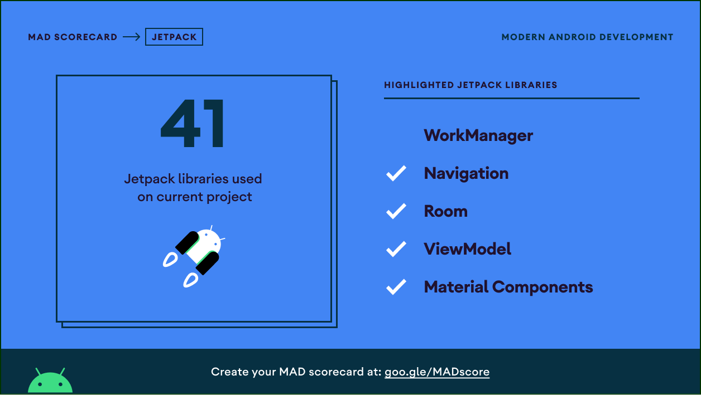

<h1 align="center">Pocket QR</h1>

<p align="center">
  <a href="https://android-arsenal.com/api?level=21"></a>
  <a href="./github/kotlin.png"></a>
  <a href="https://github.com/100nandoo"></a>
  <a href="https://opensource.org/licenses/Apache-2.0"></a>
</p>

A blazing fast QR code scanner powered by [Firebase MLKit].

## Specification
### Highlight
- [Kotlin]
  * [Coroutines]
  * [Coroutines Play Services]
  * [Coroutines Guava]
- [Firebase MLKit] for QR code detection
- [CameraX] - camera surface and control
- [Coil] - loading images
- [Awesome QR] - generate QR code image

### Other
- [AppIntro] - carousell app onboarding
- [Fast Adapter] - recyclerView adapter
- [Khronos] - intuitive date extensions
- [Koptional] - optional type value
- [Leak Canary] - memory leak detection
- [Lottie] - lottie animation
- [RecyclerView Divider] - recyclerView divider
- [Timber] - logging
- Jetpack
    * Browser - CustomTabs
    * Hilt
    * LiveData
    * Material Deisgn Components
    * Navigation
    * Room
    * ViewModel
    * Ktx


## MAD Score

<details>
  <summary>Click to expand!</summary>

  
  
  
</details>


# License
```xml
Designed and developed by 2020 100nandoo (Fernando Fransisco Halim)

Licensed under the Apache License, Version 2.0 (the "License");
you may not use this file except in compliance with the License.
You may obtain a copy of the License at

   http://www.apache.org/licenses/LICENSE-2.0

Unless required by applicable law or agreed to in writing, software
distributed under the License is distributed on an "AS IS" BASIS,
WITHOUT WARRANTIES OR CONDITIONS OF ANY KIND, either express or implied.
See the License for the specific language governing permissions and
limitations under the License.
```

[Firebase MLKit]: https://firebase.google.com/docs/ml-kit/android/read-barcodes
<!-- Specification -->
[Kotlin]: https://kotlinlang.org/
[Coroutines]: https://github.com/Kotlin/kotlinx.coroutines
[Coroutines Play Services]: https://github.com/Kotlin/kotlinx.coroutines/tree/master/integration/kotlinx-coroutines-play-services
[Coroutines Guava]: https://github.com/Kotlin/kotlinx.coroutines/tree/master/integration/kotlinx-coroutines-guava
[Awesome QR]: https://github.com/SumiMakito/AwesomeQRCode
[Coil]: https://coil-kt.github.io/coil/
[CameraX]: https://developer.android.com/training/camerax

<!-- Other -->
[AppIntro]: https://github.com/AppIntro/AppIntro
[Epoxy Adapter]: https://github.com/airbnb/epoxy
[Khronos]: http://hotchemi.github.io/khronos/
[Koptional]: https://github.com/gojuno/koptional
[Leak Canary]: https://square.github.io/leakcanary/
[Lottie]: http://airbnb.io/lottie/#/android
[Timber]: https://github.com/JakeWharton/timber
[RecyclerView Divider]: https://github.com/fondesa/recycler-view-divider
